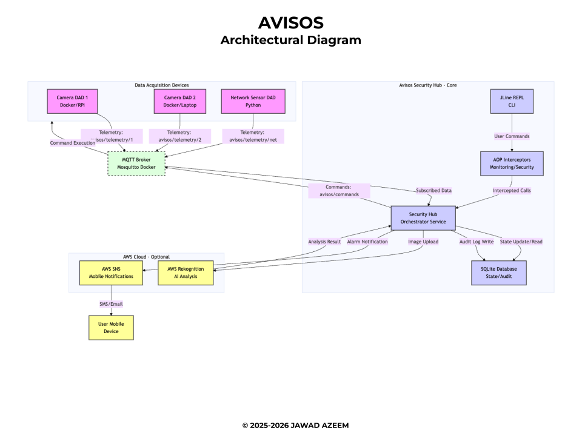

# AVISOS
***A***dvanced ***V***isual ***I***nfrastructure ***S***ecure ***O***perational ***S***ystems

#### Author: Jawad Azeem
#### Project Documentation: www.jawadazeem.com/avisos
AVISOS is an industrial-grade SCADA orchestration platform designed to secure and manage high-reliability
environments. Built on a custom-engineered backbone, it integrates computer vision AI for 
predictive threat modeling with a hardened MQTT command-bus to ensure the integrity of critical 
operations.

### Architecture Overview

