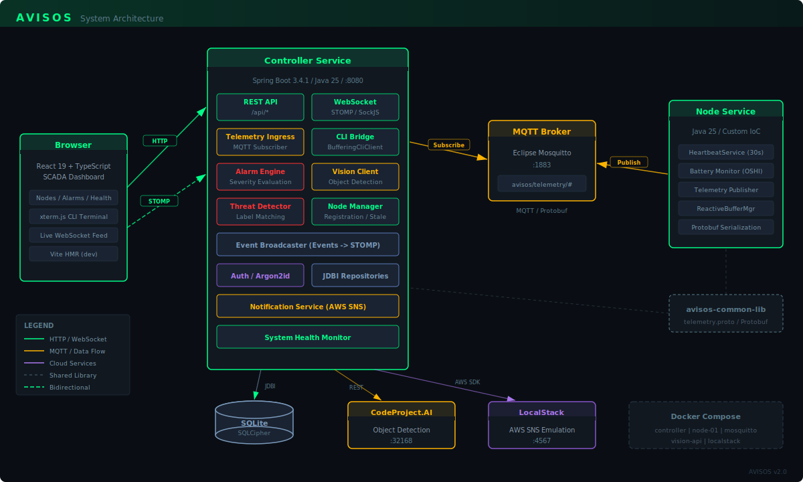

# AVISOS
***A***dvanced ***V***isual ***I***nfrastructure ***S***ecure ***O***perational ***S***ystems

**Author:** Jawad Azeem
**Live:** [avisos.jawadazeem.com](https://avisos.jawadazeem.com)

AVISOS is a SCADA orchestration platform that secures and monitors high-reliability environments using computer vision AI for real-time threat detection. Edge nodes publish telemetry over MQTT, the central controller evaluates frames through a vision AI pipeline, and operators interact through a React web dashboard with live WebSocket updates and an embedded CLI terminal.

### Architecture



### Tech Stack

| Layer | Technology |
|---|---|
| Backend | Java 25 (preview), Spring Boot 3.4.1, Virtual Threads |
| Frontend | React 19, TypeScript, Vite, xterm.js |
| Messaging | Eclipse Mosquitto (MQTT), Protobuf telemetry |
| Real-time | STOMP over WebSocket (SockJS) |
| Database | SQLite + SQLCipher (encrypted), JDBI |
| Vision AI | CodeProject.AI object detection |
| Cloud | AWS SNS via LocalStack |
| Security | Argon2id password hashing, encrypted DB |
| Build | Maven multi-module, frontend-maven-plugin (Node 22) |
| Deploy | Docker Compose (5 containers) |

### Module Structure

```
avisos-common-lib/          Protobuf definitions + generated code (telemetry.proto)
avisos-controller-service/  Central orchestration: REST API, dashboard, alarms, vision, CLI
avisos-node-service/        Lightweight IoT edge node: heartbeat, battery, telemetry
mosquitto/                  MQTT broker configuration (Eclipse Mosquitto)
```

### Quick Start

```bash
# Full stack (controller + node + broker + vision + cloud)
docker compose up --build

# Frontend dev server with hot reload (proxies to backend on :8080)
cd avisos-controller-service/src/main/frontend && npm run dev

# Build all modules
mvn clean install
```

Dashboard at `http://localhost:8080` -- pages for system overview, node monitoring, alarm management, and an embedded CLI terminal. All updates stream in real-time over WebSocket.

### API

| Endpoint | Description |
|---|---|
| `GET /api/nodes` | List registered edge nodes |
| `GET /api/alarms` | Active alarms with severity |
| `GET /api/health` | System health report |
| `GET /api/system/stats` | JVM runtime statistics |
| `WS /ws` | STOMP WebSocket (topics: `/topic/nodes`, `/topic/alarms`, `/topic/vision`, `/topic/cli`) |

### Roadmap

See [`docs/future-directions.md`](docs/future-directions.md) for planned features including the AI SOC Analyst Agent.

### License

Apache 2.0
